# Finance · meals · training — report

**Agent:** finance-health · **Stage:** 8 · **Status:** complete
**Verification:** `npx tsc --noEmit` clean · `npx electron-vite build` clean · `npx vitest run` →
**414 passed / 0 failed** (21 files), of which **105 are new** in
`test/finance-ui-budget.test.ts` (63) and `test/health-ui-nutrition.test.ts` (42).

Both surfaces were driven **in the real Electron app** against throwaway vaults — first run
seeded empty, then every state built by clicking through the UI. Screenshots below are of
that running app, not mocks.

---

## What landed

```
app/src/renderer/src/components/finance/
  budget.ts            every rule that decides how a number is drawn (React-free, tested)
  BudgetBar.tsx        the spend-vs-limit bar + SpendLine (no-limit rows)
  SpendingCard.tsx     the comp's "Spending" card, ported
  PurchaseLog.tsx      the log, grouped by day
  PurchaseDialog.tsx   log / edit / delete a purchase
  BudgetDialog.tsx     categories, limits, currency, month_starts_on — all in-app
  index.ts

app/src/renderer/src/components/health/
  nutrition.ts         totals, trends, targets, formatting (React-free, tested)
  NutritionFigure.tsx  the italic-Cormorant-when-estimated figure + EstimateNote
  EatenAndMovedCard.tsx  the comp's "Eaten & moved" card, ported
  TrendsCard.tsx       Recharts, gold, gaps not zeros
  DayLogCard.tsx       the log, newest day first
  MealDialog.tsx · WorkoutDialog.tsx · TargetsDialog.tsx
  index.ts

app/src/renderer/src/surfaces/FinanceSurface.tsx   (replaced the stub)
app/src/renderer/src/surfaces/MealsSurface.tsx     (replaced the stub)

app/src/renderer/src/store/finance.ts    reads + writes, shaped after store/inbox.ts
app/src/renderer/src/store/health.ts
app/src/renderer/src/store/settings.ts   shared by both surfaces

app/scripts/seed-vault.mjs               throwaway vault seeder, refuses the real vault
app/test/finance-ui-budget.test.ts       63 tests
app/test/health-ui-nutrition.test.ts     42 tests
```

No dependencies added. `package.json`, `src/shared/**` and `src/main/**` untouched.

Three new files landed in `store/` rather than in my own component directories, because
`.progress/design-system.md` §4 makes that the convention ("`store/inbox.ts` is the worked
example and the file to copy"). They are **new files only** — no existing file in `store/`
was edited, and `store/index.ts` was deliberately left alone, so surfaces import from
`@/store/finance` directly the way `TodaySurface` imports `@/store/inbox`.

---

## Over budget is GOLD — and here is the proof

This was called out as the single most likely place to break the "red is destructive only"
rule, so it is held in three independent places.

**1. In the component.** `BudgetBar` has no import that could supply a danger token. When a
category is over its limit:

| | |
|---|---|
| bar | stays `--accent`, fills the track **exactly once** — no hue change, no overflow, no pulse |
| track | lifts `--fill` → `--soft`, so the row is gold-on-gold rather than gold-on-grey |
| label | moves to `--accent-text` (the AA-contrast gold-as-text token) |
| figure | `--accent-text`, reading `$312 / 250 · $62 over` |
| copy | a noun phrase. No verb, no exclamation, no instruction about what to do next |

`Badge`'s `danger` tone is not used anywhere on either surface.

**2. Measured in the running app.** The driver walked every element inside `<main>` and
tested computed `color` / `background-color` / border colours against the real danger RGBs:

```
light   barFill  rgb(156,126,64)  = --accent        track rgba(156,126,64,.10) = --soft
        label    rgb(138,110,51)  = --accent-text   meta  rgb(138,110,51)
dark    barFill  rgb(200,165,100) = --accent        track rgba(200,165,100,.10)
        label    rgb(200,165,100) = --accent-text
both    dangerUsedAnywhere: false
        aria-valuetext: "Groceries, $312 of 250, $62 over"
```

**3. Guarded by a test.** `finance-ui-budget.test.ts` scans every source file in
`components/finance/**` and `components/health/**` with comments stripped, and fails on any
use of `text-danger`, `bg-danger`, `border-danger` or `tone="danger"`. It also asserts that
`variant="destructive"` appears in exactly three files — the Delete button in the purchase,
meal and workout dialogs, which genuinely destroy a record — and nowhere else.

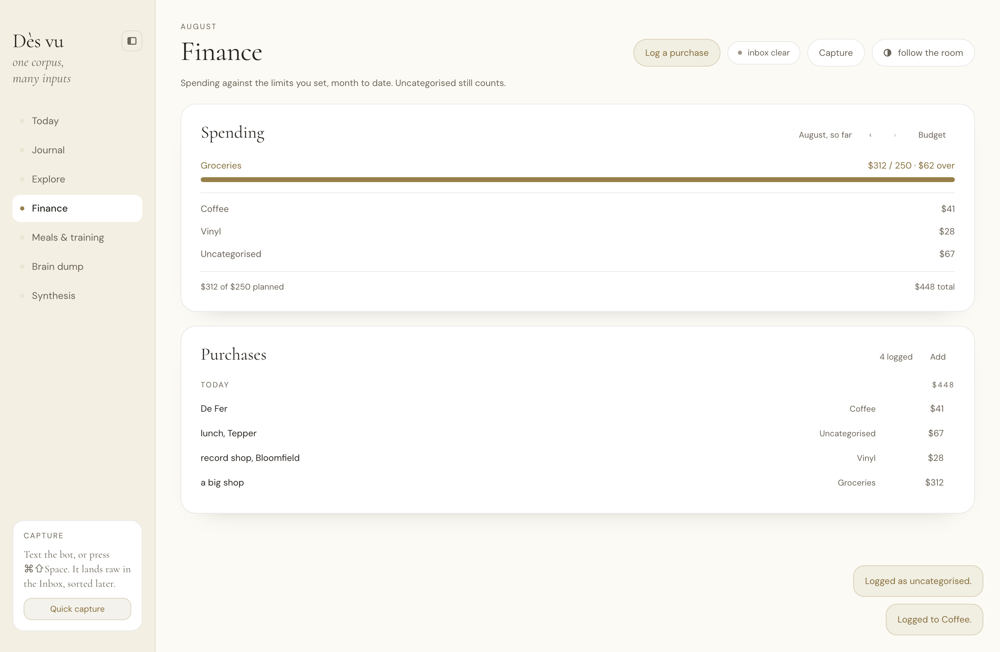
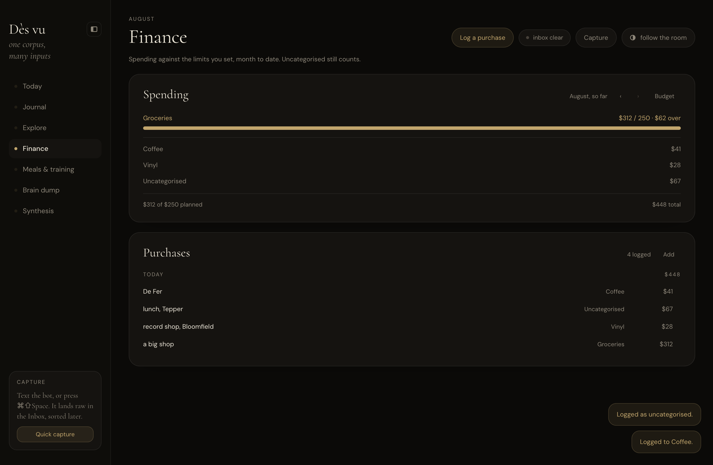

---

## First run — a designed state, not a fallback

`settings.finance.categories` ships `[]` and **nothing in the renderer ever supplies a
fallback list.** Verified in the app on a vault with no `settings.json` at all:
`hardcoded: false` against `/Groceries|Coffee|Transit|Rent|Food/`, `bars: 0`.

Day one is **one card per surface**, not a stack of empty boxes. The first pass rendered
three ("Nothing logged today." / "Nothing to plot yet." / "Nothing logged yet."), which is
nagging by repetition — three ways of saying the same absence. Trends and Log now appear
the moment anything exists, and never flash in and back out, because `data` is null until
the first successful load so the count reads 0 throughout.

> **Finance** — *No budget set yet.*
> Categories and their monthly limits are yours to define — there are none built in.
> Purchases log fine without one. · **[Add a category]**

> **Meals & training** — *Nothing logged today.*
> A description is enough. Numbers are optional and can be added later, or never.
> **[Log a meal] [Log a workout]**

No target line. No percentage. No count of what is missing. Nothing that reads as falling
short. Measured: `targetWords: false`, `bars: 0`, `cards: 1`.

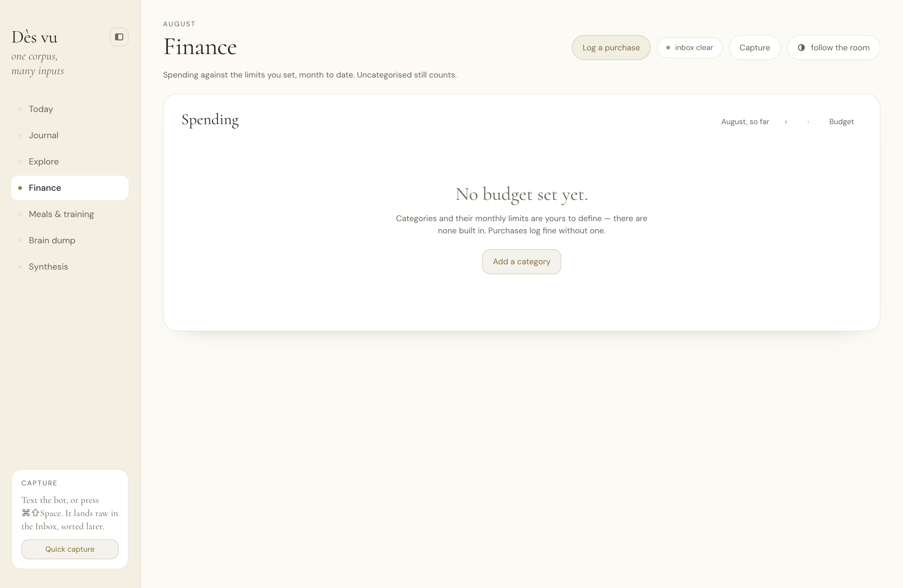
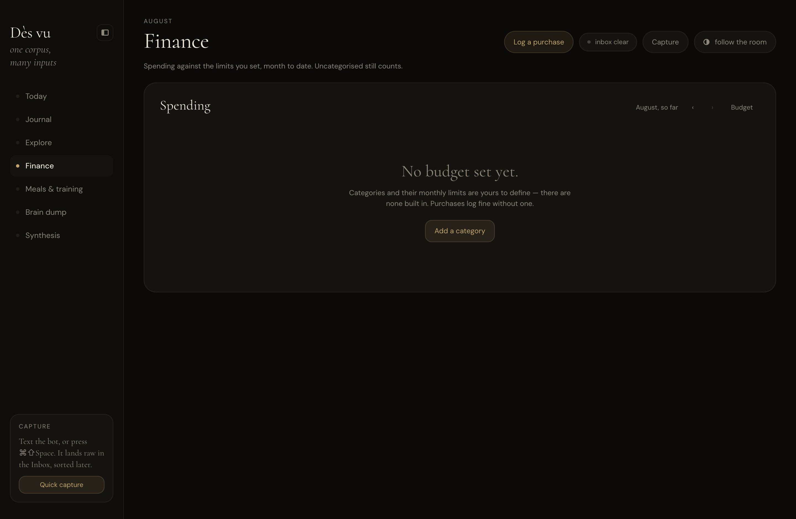
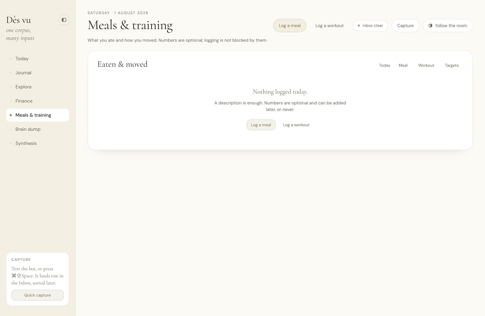
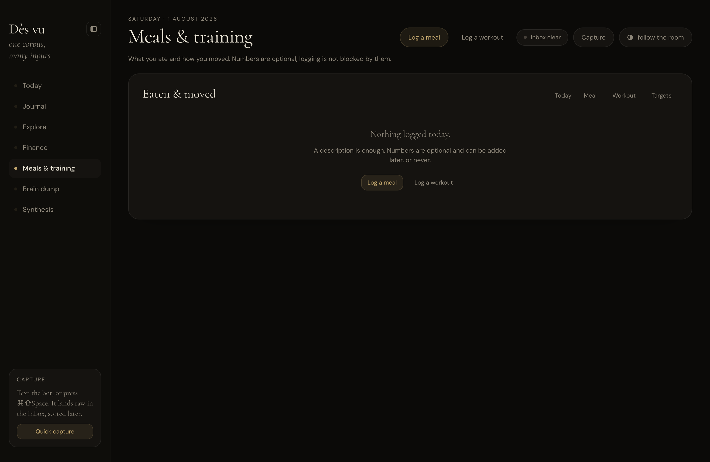

---

## Components and props

### `components/finance`

| Component | Props |
|---|---|
| `BudgetBar` | `row: CategorySpend` · `currency?`='USD' |
| `SpendLine` | `row: CategorySpend` · `currency?` · `muted?` — a category with no limit, so nothing to be over |
| `SpendingCard` | `month` · `summary: VaultQuery<CategorySpend[]>` · `settings: VaultQuery<Settings>` · `onEditCategories` · `onPrevMonth?` · `onNextMonth?` · `canGoForward?` |
| `PurchaseLog` | `purchases: VaultQuery<Purchase[]>` · `currency` · `month?` · `onAdd` · `onEdit(purchase)` |
| `PurchaseDialog` | `open` · `onClose` · `purchase?: Purchase \| null` · `categories: readonly BudgetCategory[]` · `onSaved?(message)` |
| `BudgetDialog` | `open` · `onClose` · `settings: Settings \| null` · `onSaved?(message)` |

`budget.ts` exports `UNCATEGORISED` · `isUncategorised` · `monthKeyOf` · `monthKeyOfDate` ·
`isMonthKey` · `shiftMonth` · `monthLabel` · `monthMeta` · `formatMoney` · `formatLimit` ·
`formatSpendMeta` · `barFraction` · `isOverLimit` · `overageOf` · `overageNote` ·
`spentPercent` · `groupSpend` · `isFirstRun` · `categoryLabel` · `nameIsTaken` ·
`groupPurchasesByDate` · `purchasesInMonth` · `parseAmount`.

### `components/health`

| Component | Props |
|---|---|
| `NutritionFigure` | `calories: number \| null` · `protein: number \| null` · `estimated: boolean` · `className?` — renders **nothing** when there are no numbers |
| `EstimateNote` | `className?` — the comp's one-line footnote, shown only when an estimate is on screen |
| `EatenAndMovedCard` | `meals` · `workouts` · `settings` (all `VaultQuery`) · `onLogMeal` · `onLogWorkout` · `onEditTargets` · `onEditMeal(meal)` · `onEditWorkout(workout)` |
| `TrendsCard` | `meals` · `workouts` · `settings` |
| `DayLogCard` | `meals` · `workouts` · `onLogMeal` · `onEditMeal` · `onEditWorkout` · `days?`=30 |
| `MealDialog` | `open` · `onClose` · `meal?: Meal \| null` · `onSaved?` |
| `WorkoutDialog` | `open` · `onClose` · `workout?: Workout \| null` · `onSaved?` |
| `TargetsDialog` | `open` · `onClose` · `settings: Settings \| null` · `onSaved?` |

`nutrition.ts` exports `MEAL_SLOTS` · `MEAL_SLOT_LABEL` · `WORKOUT_TYPES` ·
`WORKOUT_TYPE_LABEL` · `mealSlotOrder` · `slotForHour` · `dayTotals` · `trainingMinutes` ·
`formatMacros` · `formatMeal` · `formatDuration` · `parseDateString` · `toDateString` ·
`addDays` · `dayHeading` · `groupByDay` · `buildTrend` · `trendAverage` · `daysLogged` ·
`activeTargets` · `hasAnyTarget` · `targetFraction` · `parseOptionalNumber`.

### Stores

```ts
// reads
usePurchases() · useMonthSummary(month) · useMeals() · useWorkouts() · useSettings()

// writes — plain async functions, bridge() then invalidateVault()
logPurchase(draft) · editPurchase(id, updates) · removePurchase(id) · saveBudgetCategories(categories)
logMeal(draft)     · editMeal(id, updates)     · removeMeal(id)
logWorkout(draft)  · editWorkout(id, updates)  · removeWorkout(id)
saveNutritionTargets({calorie_target, protein_target_g, show_targets}) · updateSettings(patch)
```

`MealDraft.calories`, `.protein_g` and `WorkoutDraft.duration_minutes` are all optional and
default to `null`.

---

## The other rules, and where they are held

| Rule | How |
|---|---|
| **Taxonomy never blocks capture (F4)** | The category field is a free-text `<input>` with a `<datalist>` of the user's categories. Suggestions, never a whitelist — there is no `<select>` and no validation that can reject a name. Driven live: a purchase in `vinyl` (never defined) logged fine and got its own off-budget line. |
| **Uncategorised gets its own line** | `groupSpend` splits `monthSummary` into budgeted (bars) → tracked-but-uncapped → off-budget → **uncategorised, always last**, below a hairline. Its money is never dropped from the total. |
| **Numbers are optional (M2)** | Nothing substitutes 0 for a missing number. `dayTotals` returns `calories: null` when nothing logged carried one — a day nobody counted reads as *unknown*, never as "0 calories", which is both false and a shape the eye reads as failure. `parseOptionalNumber('')` is `{ok: true, value: null}`. Driven live: "chipotle bowl" with both fields blank saved on the first click. |
| **Estimates are italic Cormorant (M3)** | `NutritionFigure` reaches `.text-estimate` only through the `estimated` branch. Measured in the app: estimated figures compute to `Cormorant / italic`, measured ones to `"DM Sans" / normal`. A test also asserts Tailwind's bare `italic` class appears nowhere in the file — there is no DM Sans italic cut, so italicising sans text would silently substitute a fallback face. |
| **Targets start off** | `activeTargets()` is the only gate, and it returns nulls unless `show_targets` is true **and** a number is set. Tested explicitly with targets stored but `show_targets: false` → still nulls. Turning targets off leaves the numbers on disk so switching back is not retyping. |
| **Over a target is not a failure** | `TargetBar` has no over-target branch and no colour change. The bar just fills. |
| **Empty is just empty** | "Nothing logged yet." · "Nothing to plot yet." · "No budget set yet." No counts of what is missing, no "you haven't", no streak, no exclamation. Days with nothing logged are simply absent from the log. |
| **Red is only destructive** | The only red on either surface is the Delete button in the three dialogs. Enforced by the source-scan test. |
| **`CategoryMarker` is not reused** | Finance categories are user-defined strings on a different axis from `personal`/`school`/`recruiting`. `CategoryMarker` is not imported anywhere in `components/finance/**`. |
| **Settings are malleable** | `BudgetDialog` edits categories, limits, currency and `month_starts_on`; `TargetsDialog` edits both targets and the toggle. That is all of `settings.finance` and all of `settings.nutrition`. Nothing requires a code change. |
| **Errors are quiet** | Each card renders a muted line that says what survived — "Nothing was lost — every purchase is still in the vault." Dialogs keep the text and stay open on a failed write. |

### The chart

Gold bars, no new hues. A day with nothing logged carries `null`, so Recharts draws **no
bar** — a gap in the row. Plotting it as zero would spike to the axis on every day the user
did not write anything down, which reads as a crash and is the chart equivalent of a broken
streak. `trendAverage` divides by the days that carry a number, not by the window, so a
quiet day cannot drag the average down.

`fill="var(--accent)"` on `<Bar>` was verified to resolve at runtime in both themes
(`rgb(156,126,64)` light, `rgb(200,165,100)` dark) — Chromium supports `var()` in SVG
presentation attributes, so no JS colour plumbing is needed.

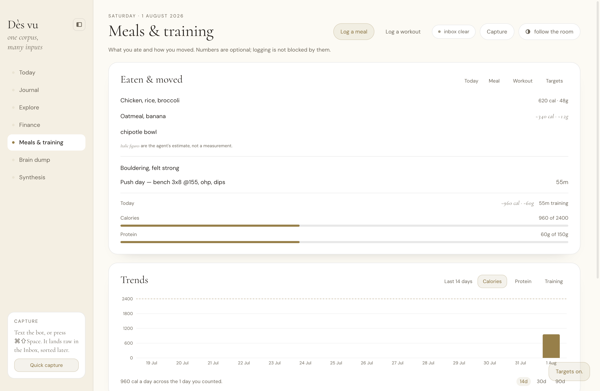
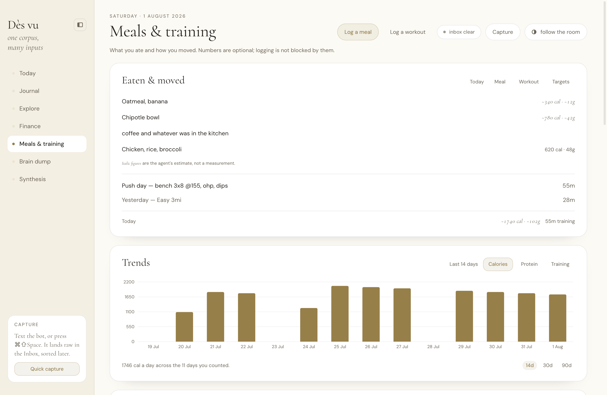
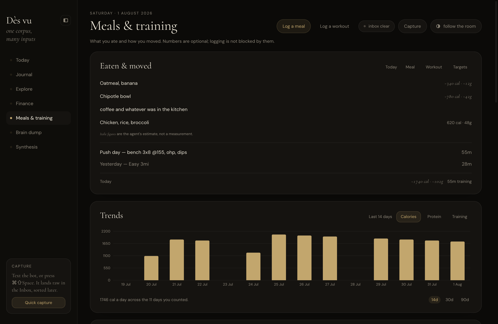
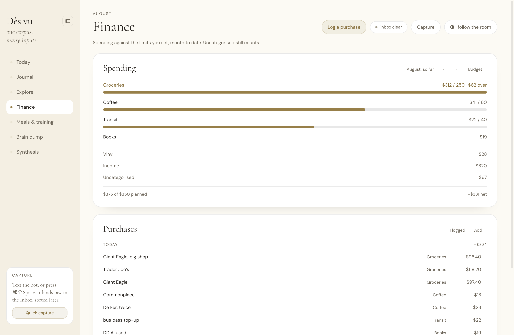
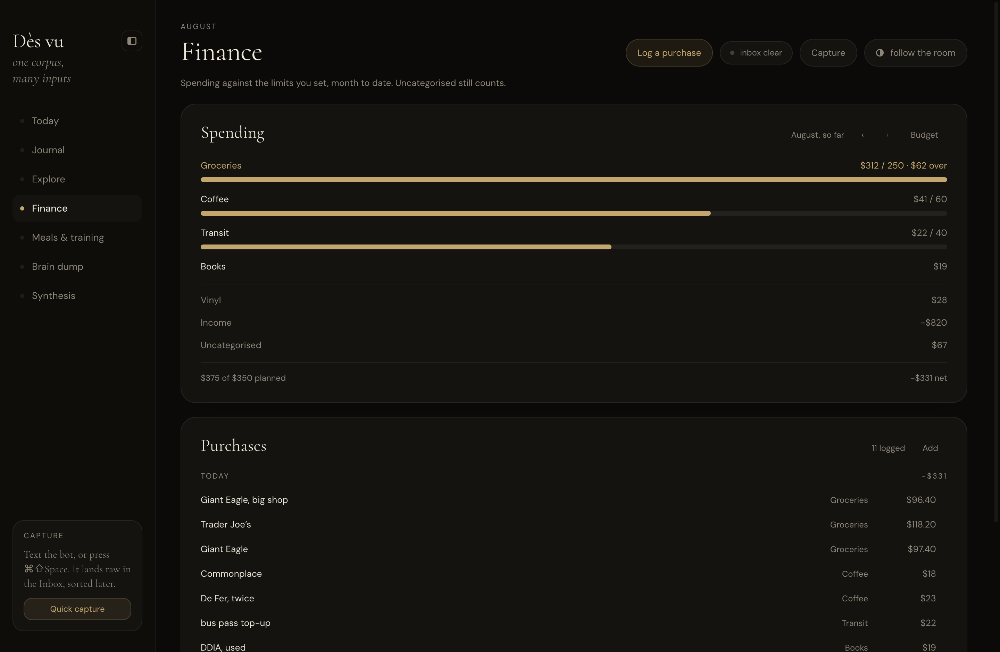

---

## What was driven in the running app

`npx electron-vite build` then real Electron over CDP, `DESVU_VAULT` pointed at a temp
vault. Every state below was produced by clicking, typing and saving through the UI —
the records were written by the app, then read back from disk.

| Step | Result |
|---|---|
| First run, both surfaces, both themes | one card each, no bars, no targets, no hardcoded categories |
| Add a budget category (groceries, 250) | `settings.json` written with the one category; `categories: []` before |
| Log $312 to groceries | over limit → **gold** bar, gold label, `$62 over`, `dangerUsedAnywhere: false` |
| Log $28 to `vinyl` (undefined category) | logged; own off-budget line |
| Log $67 with **no** category | logged; own Uncategorised line, last |
| Log a meal with **no numbers** | saved on first click, `calories: null, protein_g: null` on disk, dialog closed |
| Log a meal marked estimated | `estimated: true` on disk; renders `~340 cal · ~12g` in Cormorant italic |
| Log a measured meal | renders `620 cal · 48g` in DM Sans |
| Log a workout with 55m, and one with **no** duration | both saved; the second renders with no duration and no placeholder |
| Turn targets on (2400 / 150) | target bars + a gold dashed reference line at 2400 appear |
| Turn targets off again | reference line gone, no target words anywhere, numbers preserved on disk |
| Both themes throughout | `electronErrors: []` |

Two bugs were found this way and fixed:

1. **The card footer compared the wrong two numbers.** It read `−$331 of $350 planned` —
   the month's *net* (income and off-budget included) against three grocery limits, which
   is not a real comparison. `groupSpend` now also returns `budgetedSpent`, and the line
   reads `$375 of $350 planned` · `−$331 net` (it says "total" when no money came in).
2. **The target reference line silently did not render.** Recharts computes the Y domain
   from the data alone, so a target above every logged day was dropped — exactly when the
   line matters most. Fixed with `ifOverflow="extendDomain"`.

### Seeding

`app/scripts/seed-vault.mjs` — no dependencies, prints the path it made.

```bash
DESVU_VAULT="$(node scripts/seed-vault.mjs)" npm run dev          # populated scenario
DESVU_VAULT="$(node scripts/seed-vault.mjs --empty)" npm run dev  # day one
node scripts/seed-vault.mjs --out <dir>                           # somewhere specific
```

**It cannot write to the real vault.** `--out` is resolved, NFC-normalized and refused if
it is `~/Documents/Dès vu`, the iCloud path behind it, or anything under either; the
default is a fresh `mkdtemp` in `os.tmpdir()`. Verified by pointing `--out` at the real
vault and getting `refusing to seed test data into the real vault` + exit 1. It also drops
a `data/SCHEMAS.md` marker so the hardened `isVault()` never has to guess what the
directory is. `~/Documents/Dès vu` was confirmed untouched after every run: symlink intact,
83 journal entries, git clean.

---

## Storage gaps and contract notes

Nothing blocked. Four things worth the orchestrator's eye, none urgent:

1. **`UNCATEGORISED` is mirrored, not shared.** The constant lives in
   `src/main/repos/financeRepository.ts`, which the renderer cannot import (it pulls
   `node:fs`), and it is not on `@shared/types`. `components/finance/budget.ts` re-declares
   it. **A test asserts the two are equal** so they cannot drift silently, but the right
   home is `@shared/types` next to `CategorySpend`.

2. **`dayHeading` is in the wrong directory.** "Today" / "Yesterday" / "Sat 26 Jul" is
   generic and belongs in `@/lib/date` beside `formatDayLine`. That file is not mine, so it
   currently lives in `components/health/nutrition.ts` and `PurchaseLog` imports it across
   directories. Cosmetic; flagged rather than moved.

3. **`financeRepository.monthSummary` cannot distinguish uncapped-by-choice from
   unknown.** `CategorySpend.limit` is `null` for both a configured category with no limit
   and a category settings has never heard of. The UI resolves it by cross-referencing
   `settings.finance.categories`, which works, but a `configured: boolean` on `CategorySpend`
   would remove the need for callers to hold both queries. Not worth a contract change on
   its own.

4. **`Meal.estimated` is one flag for two numbers.** A meal whose calories were measured but
   whose protein was guessed can only be all-italic or none. This matches `SCHEMAS.md` and
   is almost certainly right — per-field provenance is more bookkeeping than the product
   wants — but it is a real limit and the UI cannot work around it.

Everything else the surfaces needed was already on `DesvuApi` and behaved as documented.
`monthSummary` returning configured-but-unspent categories at zero, and spent-in-but-
unconfigured categories at their real amount, is exactly what the card needs.

---

## Left for later

- **The Today surface's "Spending" and "Eaten & moved" cards.** `SpendingCard` and
  `EatenAndMovedCard` are exported from their barrels and take `VaultQuery` props, so
  Today can mount them as-is. Both are sized for a full-width column; the comp's card grid
  is `minmax(178px, 1fr)`, so whoever builds Today should check them at that width.
- **Editing a purchase from the Spending card.** Only the log rows open the editor.
- **A month picker.** Stepping is `‹` / `›` one month at a time; there is no jump-to-month
  and no year view.
- **`month_starts_on` is honoured by the repository but not shown.** The card meta says
  "August, so far" even when the period runs the 15th→14th. The number is editable in
  `BudgetDialog`; the label does not yet say what period it means.
- **Recharts costs 828 KB of the 1.37 MB renderer bundle** — measured, by building once
  with `TrendsCard` removed (543 kB) and once with it (1,371 kB). It is the single largest
  thing in the app and it draws one bar chart. Fine for a local Electron app that makes no
  network requests, but worth knowing: if a second chart ever needs a different library,
  the answer is almost certainly to drop Recharts rather than add one, and a hand-rolled
  SVG bar chart would be a few dozen lines against this design system's single accent.
- **No CSV import for purchases.** Capture is the bot plus this form.
